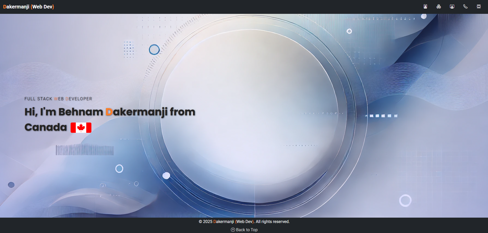
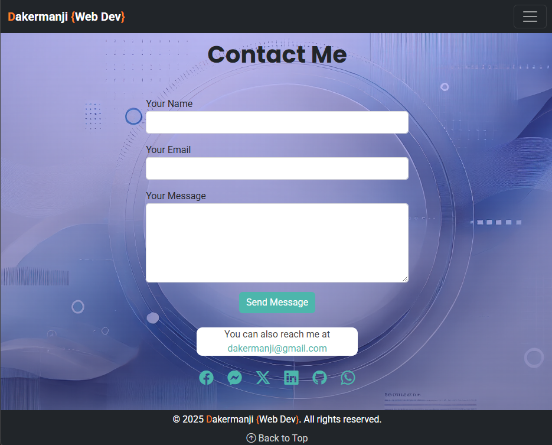
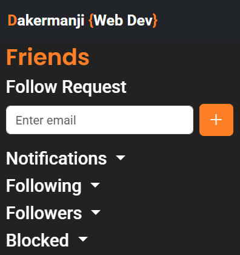
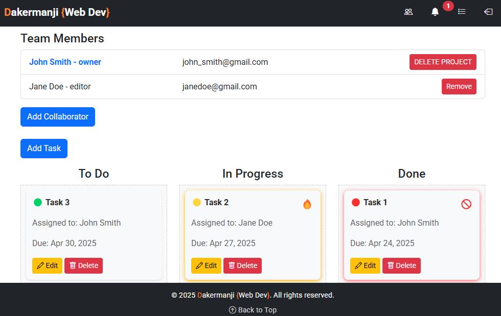
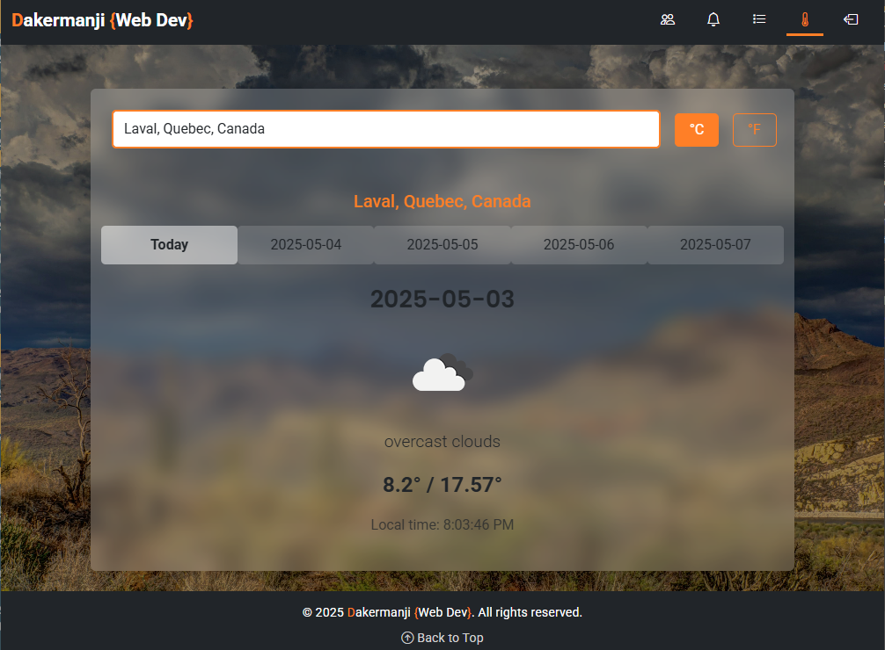

# Dakermanji Web Dev Portfolio

## Overview

- This is a personal portfolio website showcasing my skills, projects, and professional experience as a full-stack web developer. The website includes dynamic sections such as "About Me," "Services," "Portfolio," and "Contact Me," with data stored in a MySQL database.

- It also features authentication, messaging, social interactions (follows, blocks, notifications), a Task Management System, a dynamic Projects showcase page, and a Weather Application with local timezone and background images.

## Features

- **Dynamic Content**:
  - "About Me," "Services," and "Portfolio" sections rendered using EJS templates.
  - Modularized data sources for flexible updates.
- **Authentication**:
  - Local login and registration with password hashing.
  - Google and GitHub OAuth login.
  - Email confirmation and password reset functionality.
- **User Interactions**:
  - Follow and unfollow users.
  - Block and unblock users.
  - Notifications for follow requests and status updates.
- **Task Management System**:
  - Full **CRUD operations for tasks and projects**.
  - **Drag-and-drop functionality** for easy task status updates.
  - **Role-based collaboration**: Owners, Editors, and Viewers.
  - **Real-time UI updates via AJAX**.
  - **Bootstrap modals** for creating, editing, and deleting tasks.
  - **Dynamic Projects Page**:
  - - Projects are rendered dynamically from a data file
  - - Responsive Bootstrap card layout
  - - Clean scaling for desktop and mobile
  - - Easy to add new projects without modifying EJS templates
- **Weather Application**:
  - **Search cities worldwide with autocomplete** using OpenWeather and Geocoding API
  - **Dynamic background images** powered by Unsplash API based on weather conditions
  - Local timezone support with automatic local time display
  - Responsive and clean design using Bootstrap + custom styles
  - Mobile friendly layout with smooth UX and loading indicators
- **Messaging**:
  - Allows user-linked messages with timestamped storage.
- **Contact Form**:
  - Messages are sanitized, validated, and securely stored in a database.
- **Responsive Design**:
  - Optimized for all devices using Bootstrap and custom CSS.
- **Error Tracking**:
  - Tracks errors and monitors performance using Sentry.
- **SEO Friendly**:
  - Adheres to modern web standards for better discoverability.

## Technologies Used

- **Backend**: Node.js, Express.js
- **Database**: MySQL with MySQL2 package
- **Frontend**: EJS, Bootstrap 5, custom CSS (modularized for each section)
- **Task Management System**:
  - **Drag-and-drop** with JavaScript event handling.
  - **AJAX-based real-time updates**.
  - **Role-based authentication for collaboration**.
- **Weather Application**:
  - **OpenWeather API** (5-day forecast + current conditions)
  - **Unsplash API** (dynamic background images)
  - **Geocoding API** (city lookup with country/state support)
  - **tz-lookup** (timezone calculation)
- **Authentication**: Passport.js (local, Google, GitHub)
- **Email Service**: Nodemailer
- **Error Tracking**: Sentry
- **Other Packages**: dotenv, bcrypt, connect-flash, uuid

## Setup Instructions

### Prerequisites

- Node.js (v14+)
- MySQL (v8+)
- Git

### Installation

1. Clone the repository:

   ```bash
   git clone https://github.com/Dakermanji/website.git
   cd website
   ```

2. Install dependencies:

   ```bash
   npm install
   ```

3. Set up environment variables:
   - Create a `.env` file in the root directory with the following variables:

     ```env
     HOST=localhost
     PORT=3000
     DB_HOST=localhost
     DB_USER=root
     DB_PASSWORD=yourpassword
     DB_NAME=yourdatabase
     DB_PORT=3306
     SESSION_SECRET=your-session-secret
     GITHUB_CLIENT_ID=your-github-client-id
     GITHUB_CLIENT_SECRET=your-github-client-secret
     GOOGLE_CLIENT_ID=your-google-client-id
     GOOGLE_CLIENT_SECRET=your-google-client-secret
     SMTP_HOST=smtp.example.com
     SMTP_PORT=587
     SMTP_USER=your-email@example.com
     SMTP_PASSWORD=your-email-password
     ```

4. Initialize the database:
   - Execute the SQL scripts in the `sql/` folder.

5. Start the server:

   ```bash
   npm run dev
   ```

6. Open your browser and navigate to:

   ```bash
   http://localhost:3000
   ```

## Screenshots

### Home Page



### Contact Form



### Friends Panel



### Task Manager



### Weather Application



## Contribution

Contributions are welcome! Follow these steps to contribute:

1. Fork the repository.
2. Create a new branch:

   ```bash
   git checkout -b feature-name
   ```

3. Commit your changes:

   ```bash
   git commit -m "Add feature-name"
   ```

4. Push to your branch:

   ```bash
   git push origin feature-name
   ```

5. Open a pull request on GitHub.

## License

This project is licensed under the [MIT License](LICENSE).

## Contact

If you have any questions or feedback, feel free to contact me:

- **Email**: [dakermanji@gmail.com](mailto:dakermanji@gmail.com)
- **LinkedIn**: [LinkedIn Profile](https://linkedin.com/in/dakermanji)
- **GitHub**: [GitHub Profile](https://github.com/Dakermanji)
